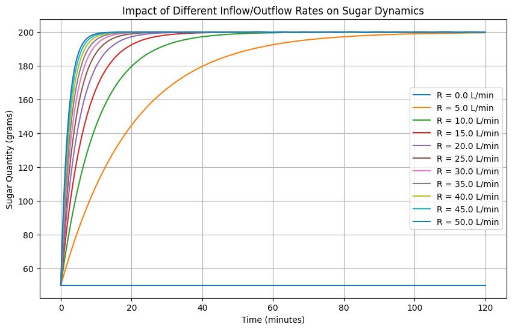
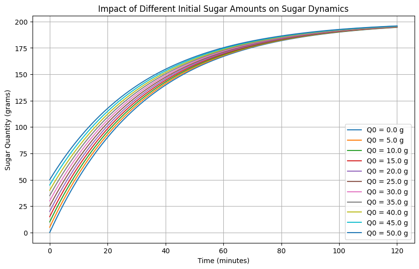
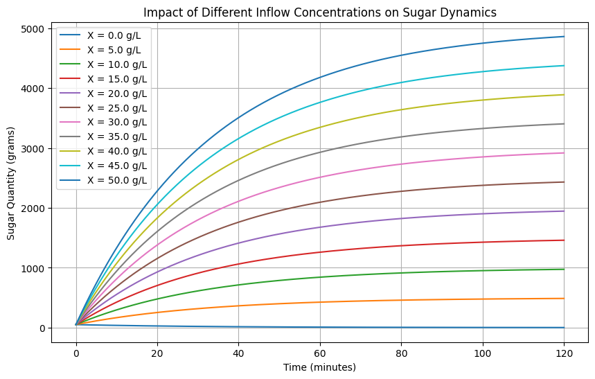

# ODE Solution Mixing Simulation

A numerical simulation of a classic **solution-mixing ordinary differential equation** problem. The project models how the amount of sugar in a well-stirred 100 L tank changes when solution flows in and out at the same rate.

The governing equation used in the notebook is

\[
\frac{dQ}{dt}=R\left(X-\frac{Q}{100}\right)
\]

where:

- \(Q(t)\) is the amount of sugar in the tank (g)
- \(Q_0\) is the initial amount of sugar (g)
- \(X\) is the incoming sugar concentration (g/L)
- \(R\) is the equal inflow/outflow rate (L/min)

## What the notebook explores

The notebook implements all three parameter studies from the assignment:

1. **Varying flow rate \(R\)** while keeping \(Q_0\) and \(X\) fixed
2. **Varying initial sugar \(Q_0\)** while keeping \(R\) and \(X\) fixed
3. **Varying inflow concentration \(X\)** while keeping \(Q_0\) and \(R\) fixed

The differential equation is solved numerically with `scipy.integrate.solve_ivp`, and the resulting trajectories are plotted with Matplotlib.

## Results

### Effect of inflow/outflow rate

<p align="center">
  
</p>

### Effect of initial sugar quantity

<p align="center">
  
</p>

### Effect of inflow concentration

<p align="center">
  
</p>

## Repository structure

```text
.
├── README.md
├── requirements.txt
├── assignment/
│   └── 2024 Fall ODE Bonus Project.pdf
├── notebook/
│   └── ode_bonus_project.ipynb
└── assets/
    ├── vary-flow-rate.png
    ├── vary-initial-sugar.png
    └── vary-inflow-concentration.png
```

## Running the notebook

```bash
python -m venv .venv
source .venv/bin/activate
pip install -r requirements.txt
jupyter notebook notebook/ode_bonus_project.ipynb
```

Each section prompts for the relevant parameters and simulation duration.

## Course context

Created for the **EECS203002 Ordinary Differential Equations** bonus project at National Tsing Hua University, Fall 2024.

The original assignment specification is included in [`assignment/2024 Fall ODE Bonus Project.pdf`](assignment/2024%20Fall%20ODE%20Bonus%20Project.pdf).

---

This repository preserves the submitted notebook unchanged; the README and repository organization were added for documentation and reproducibility.
